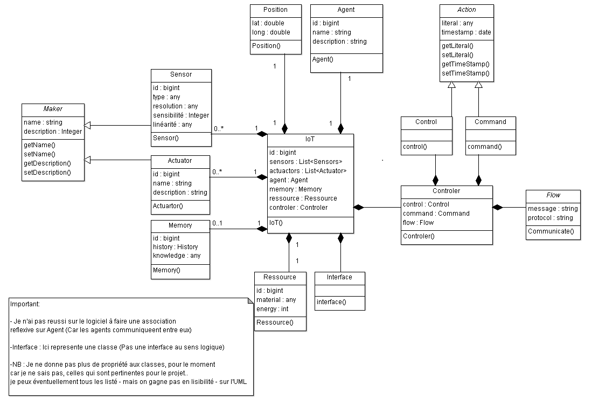

IoT-Model
===================

----------

Description
-------------

The purpose is to implement IoT Model for CBIoTs in c++.

> **Note:** Technologies.
> We will use SNAP librairy, and we try to parse our IoT objet and put them to SNAP objet.

----------

IoT Model
-------------------

